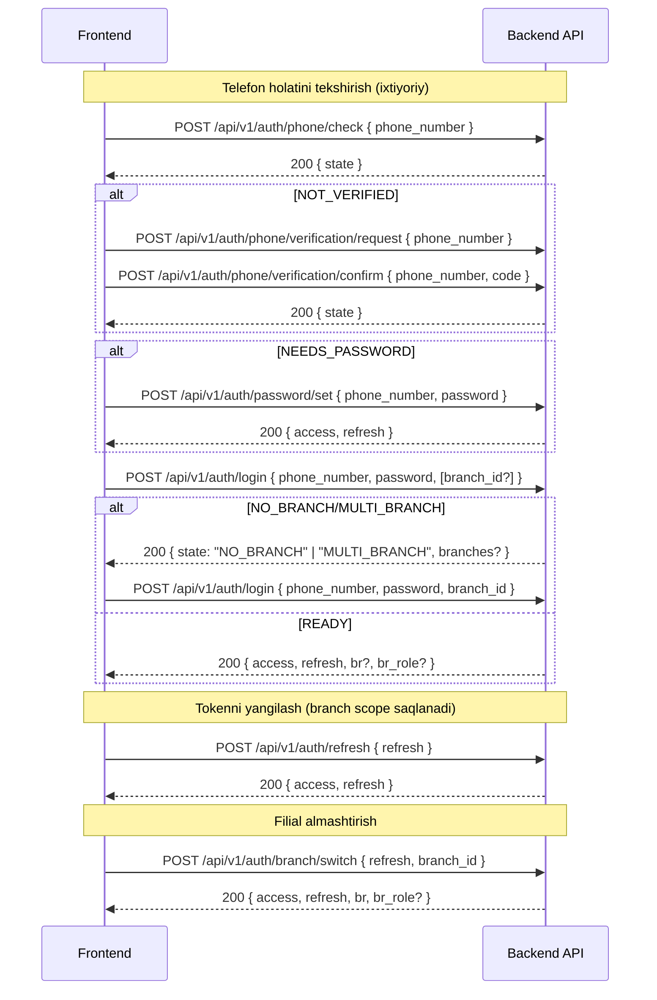

# Auth — Telefon, OTP tasdiqlash, Parol va Branch-scoped JWT

Telefon raqami asosiy identifikator. Foydalanuvchi admin tomonidan tizimga qo‘shiladi (self-register yo‘q). Foydalanuvchi bir marta telefon raqamini OTP bilan tasdiqlaydi, keyin parol o‘rnatadi va keyingi loginda telefon+parol bilan kiradi.

Foydalanuvchi bir nechta filialga (branch) tegishli bo‘lishi mumkin. JWT token ichida tanlangan filial `br` claim sifatida saqlanadi (branch-scoped JWT). Superadmin/Admin uchun default global token (scopesiz), xohlasa `branch_id` tanlab scope bilan ishlashi mumkin.

## Asosiy holatlar (state)
- `NOT_FOUND` — bunday telefon bilan user yo‘q (adminlar telegram orqali ogohlantiriladi)
- `NOT_VERIFIED` — telefon tasdiqlanmagan (OTP kerak)
- `NEEDS_PASSWORD` — parol o‘rnatilmagan (parol o‘rnatish kerak)
- `NO_BRANCH` — foydalanuvchining faol filial a’zoligi yo‘q
- `MULTI_BRANCH` — foydalanuvchi bir nechta faol filialga ega, tanlash kerak
- `READY` — hammasi tayyor (login qilish mumkin)

## Oqim (high-level)



## Endpointlar

Telefon holati va tasdiqlash:
- POST `/api/v1/auth/phone/check/`
  - Body: `{ "phone_number": "+99890..." }`
  - Response: `{ "state": "NOT_FOUND"|"NOT_VERIFIED"|"NEEDS_PASSWORD"|"READY" }`
  - Izoh: `NOT_FOUND` bo‘lsa adminlarga Telegram xabar yuboriladi (rate-limited).

- POST `/api/v1/auth/phone/verification/request/`
  - Body: `{ "phone_number": "+99890..." }`
  - Response: `{ "detail": "OTP sent", "state": ... }`

- POST `/api/v1/auth/phone/verification/confirm/`
  - Body: `{ "phone_number": "+99890...", "code": "123456" }`
  - Response: `{ "state": "NEEDS_PASSWORD"|"READY", access/refresh agar parol bor bo‘lsa }`

Parol:
- POST `/api/v1/auth/password/set/`
  - Body: `{ "phone_number": "+99890...", "password": "StrongP@ss1" }`
  - Response: `{ "state": "READY", "access": "...", "refresh": "..." }`

- POST `/api/v1/auth/password/reset/request-otp/`
  - Body: `{ "phone_number": "+99890..." }`
  - Response: `200 OK` (doim)

- POST `/api/v1/auth/password/reset/confirm/`
  - Body: `{ "phone_number": "+99890...", "code": "123456", "new_password": "StrongP@ss1" }`
  - Response: `{ access, refresh }`

Login va filial tanlash:
- POST `/api/v1/auth/login/`
  - Body: `{ "phone_number": "+99890...", "password": "...", "branch_id"?: "uuid" }`
  - Response:
    - OK: `{ access, refresh, user, br?, br_role? }`
    - yoki `{ state: "NO_BRANCH" }`
    - yoki `{ state: "MULTI_BRANCH", branches: [ { branch_id, branch_name, branch_type, branch_status, role, title } ] }`
  - Qoidalar:
    - Superadmin/Admin: default global token (br yo‘q). Agar `branch_id` bersa — scoped token.
    - Oddiy user: faol filial a’zoliklari (status = active) bo‘lsa — bitta bo‘lsa auto; ko‘p bo‘lsa tanlash kerak; yo‘q bo‘lsa NO_BRANCH.

- GET `/api/v1/auth/branches/mine/`
  - Header: `Authorization: Bearer <access>`
  - Response: `{ results: [ { branch_id, branch_name, branch_type, branch_status, role, title } ], count }`

- POST `/api/v1/auth/branch/switch/`
  - Body: `{ "refresh": "...", "branch_id": "uuid" }`
  - Response: `{ access, refresh, br, br_role? }`
  - Qoidalar:
    - Superadmin/Admin: har qanday `active` filialga scope qilish mumkin.
    - Oddiy user: faqat o‘zining `active` a’zoligi mavjud filialga scope.

Tokenlarni yangilash:
- POST `/api/v1/auth/refresh/`
  - Body: `{ "refresh": "..." }`
  - Response: `{ access, refresh }` — agar refresh ichida `br` claim bo‘lsa, yangilangan access ham shu scope bilan keladi.
  - Agar `br` bo‘lsa va filial `inactive/archived` bo‘lib qolgan yoki a’zolik o‘chirilgan bo‘lsa — `401` qaytariladi.

Profil:
- GET `/api/v1/auth/me/`

## JWT claimlar
- `br` — branch id (uuid)
- `br_role` — foydalanuvchining shu branchdagi ro‘li (oddiy userlar uchun). Adminlar uchun bu qo‘yilmaydi.

## Ruxsat va Branch konteksti
- Header `X-Branch-Id: <uuid>` yuborish shart emas, chunki JWT ichida `br` claim bor. Lekin agar JWT globalsiz bo‘lsa, `X-Branch-Id` yoki `?branch_id=` orqali ham kontekst berish mumkin.
- Backend `HasBranchRole` permission:
  - Avval JWT `br` claimni oladi.
  - Bo‘lmasa `X-Branch-Id` header → `branch_id` param → `kwargs` tartibida aniqlaydi.
  - Superadminga bypass.
  - Branch va a’zolik mavjudligini runtime tekshiradi.

## Telegram ogohlantirishlar
- Noma’lum telefon bilan urinish: adminlarga o‘zbekcha xabar (rate-limited, 5 daqiqa) — `send_unknown_phone_attempt_task`.
- OTP yuborish: dev/prodga qarab SMS/Telegramga jo‘natish konfiguratsiyasi (env orqali `TELEGRAM_OTP_NOTIFY=true`).

## Parol va OTP siyosati
- Parol kuchli validatsiya: Django validators.
- OTP purpose: `verify` (telefon tasdiqlash), `reset` (parolni tiklash). TTL va throttling bor.

## Frontend uchun maslahatlar
- Login UI:
  - Birinchi urinish: phone+password (branch_id ixtiyoriy). `MULTI_BRANCH` qaytsa — filial tanlash modalini oching va qayta yuboring.
  - `NOT_VERIFIED` bo‘lsa — OTP tasdiqlash flow’ga o‘ting.
  - `NEEDS_PASSWORD` bo‘lsa — parol o‘rnatish ekranini ko‘rsating.
  - `NO_BRANCH` bo‘lsa — “admin bilan bog‘laning” xabarini ko‘rsating.
- Tokenlarni saqlash: access (qisqa), refresh (uzoq). Branch scope saqlanadi.
- Branch almashtirish: `/auth/branch/switch` orqali yangi juft token oling.

## Namuna javoblar

Login (multi-branch):
```
200 OK
{
  "state": "MULTI_BRANCH",
  "branches": [
    {"branch_id": "...", "branch_name": "Chilonzor", "role": "teacher", "branch_status": "active"},
    {"branch_id": "...", "branch_name": "Yunusobod", "role": "branch_admin", "branch_status": "active"}
  ]
}
```

Login (scoped):
```
200 OK
{
  "access": "...",
  "refresh": "...",
  "user": { ... },
  "br": "uuid",
  "br_role": "teacher"
}
```

Branch switch:
```
POST /api/v1/auth/branch/switch { refresh, branch_id }
200 OK { access, refresh, br, br_role }
```

