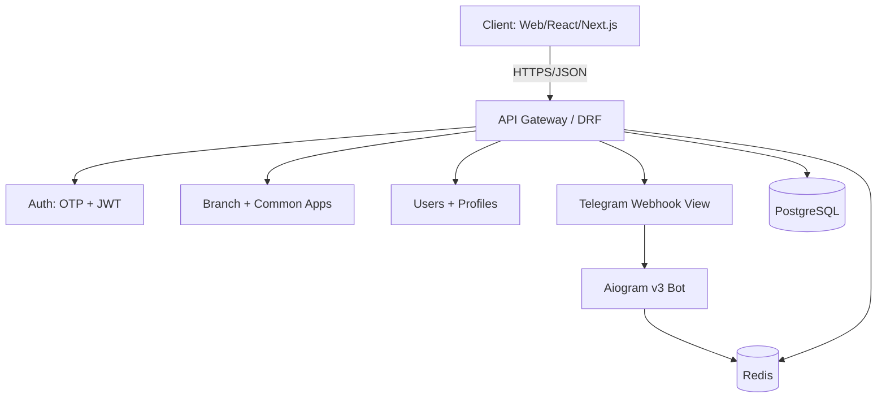

# Arxitektura

Mendeleyev backend quyidagi asosiy komponentlardan iborat:

- DRF: RESTful API, `/api/v1/` bilan versiyalash.
- JWT: SimpleJWT bilan access/refresh tokenlar.
- OTP: Redis yoki DB-based transient saqlash; realda SMS provider (Twilio yoki lokal) orqali yuboriladi (Celery queue).
- Aiogram v3: Telegram bildirishnomalari va webhook integratsiyasi.
- Docker Compose: Django + Postgres + Redis + Nginx konteynerlari.

## Muhim dizayn qarorlar

- RBAC per-branch: user bir nechta filialga biriktiriladi, har filialda roli alohida.
- Soft delete va timestamps: audit uchun.
- Swagger: drf-spectacular orqali avtomatik hujjat.

Qo'shimcha tafsilotlar uchun: [permissions-rbac.md](permissions-rbac.md), [database.md](database.md), [bot.md](bot.md).
