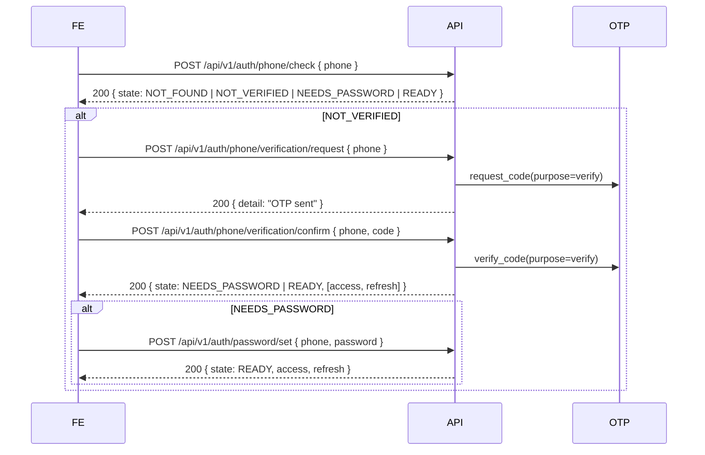
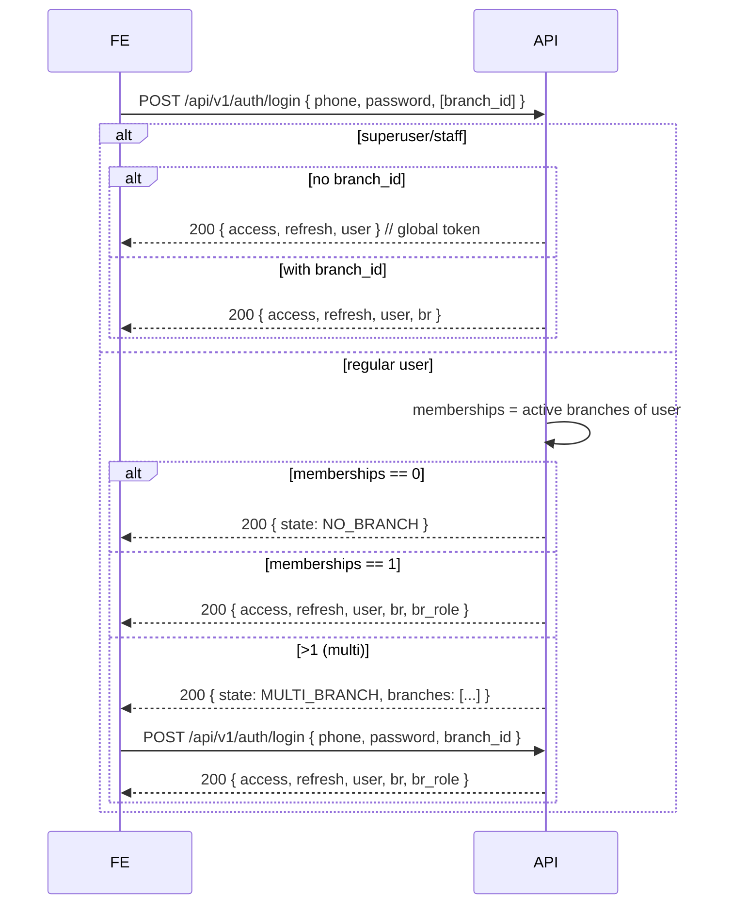
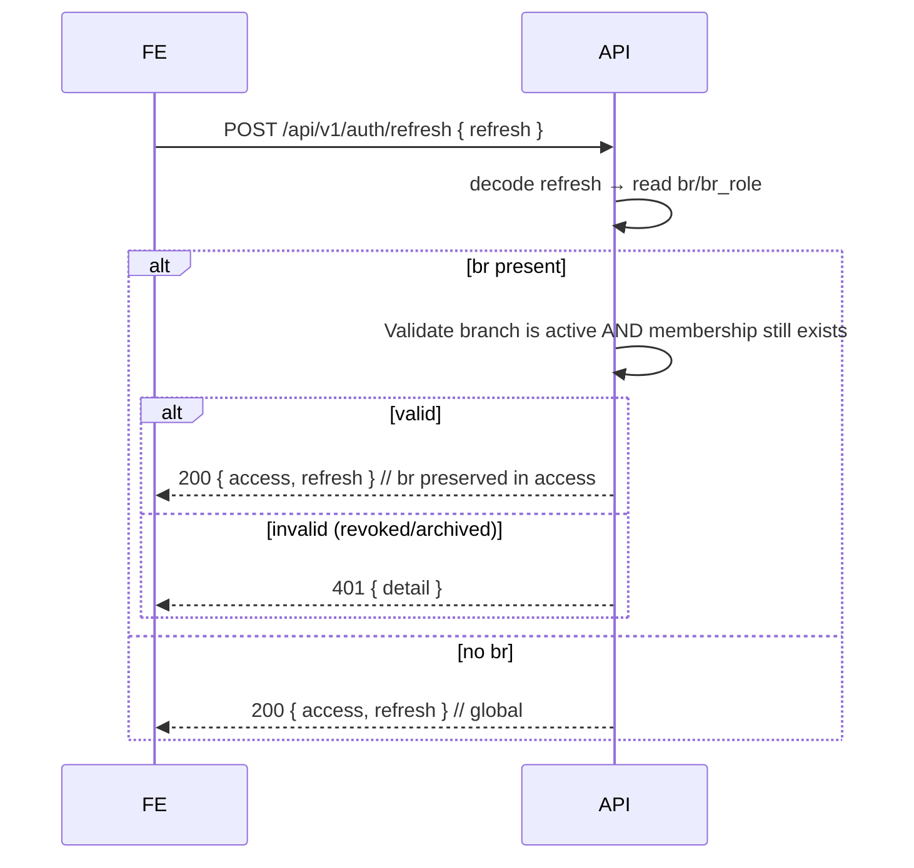
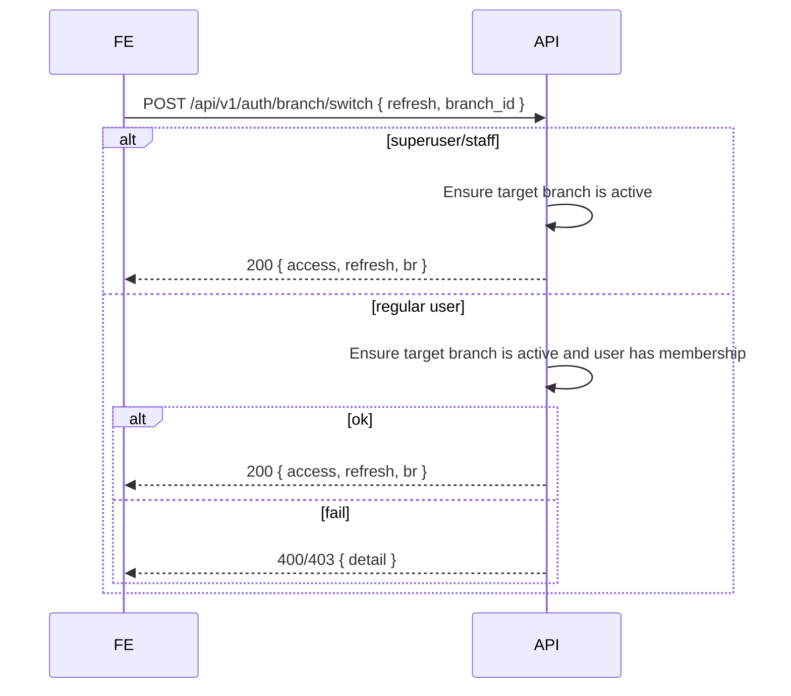

# Auth and Branch Flow

Below are concise diagrams that show how the system works: phone verification, password setup, login with branch selection, token refresh, and branch switching. Use them as a quick reference when wiring the frontend.

## Legend
- FE = Frontend client
- API = Django REST API
- OTP = OTP service (Redis + Celery)
- RBAC = Roles via UserBranch

## 1) Phone check → verify → set password

Notes:
- Unknown phone triggers a Telegram admin notify in the background (throttled).
- If the user already has a password when confirming verification, the API returns tokens immediately.

## 2) Login with branch selection

Notes:
- For regular users, tokens are branch-scoped. Claims include `br` and `br_role`.
- Superusers/staff get global tokens by default (no `br`), but can request a scoped token by passing `branch_id`.

## 3) Refresh token (scope preserved)

## 4) Switch branch (re-issue scoped tokens)

---

## Frontend integration cheat-sheet

1) Phone check before any auth action
   - Call `/api/v1/auth/phone/check` and branch based on `state`.
2) Verification and password set
   - For `NOT_VERIFIED`: request + confirm OTP; if response `NEEDS_PASSWORD`, call password set.
3) Login
   - Call `/api/v1/auth/login` with `phone` and `password`.
   - Handle `MULTI_BRANCH` by showing branch list and re-posting with `branch_id`.
4) Token storage
   - Store `access` (short-lived) and `refresh` (long-lived).
   - On API requests, use `Authorization: Bearer <access>`.
5) Refresh flow
   - When access expires, call `/api/v1/auth/refresh` with `refresh`.
   - If 401 due to branch/membership issues, re-login (and/or re-select branch).
6) Switch branch (if multi-branch)
   - Call `/api/v1/auth/branch/switch` with the current `refresh` and a new `branch_id`.
   - Replace tokens with the new pair from the response.

### Claims and headers
- Access token may contain:
  - `br`: current branch id (string)
  - `br_role`: role in that branch (for regular users)
- Permissions on the backend first read `br` from the token; avoid custom headers unless absolutely necessary.
