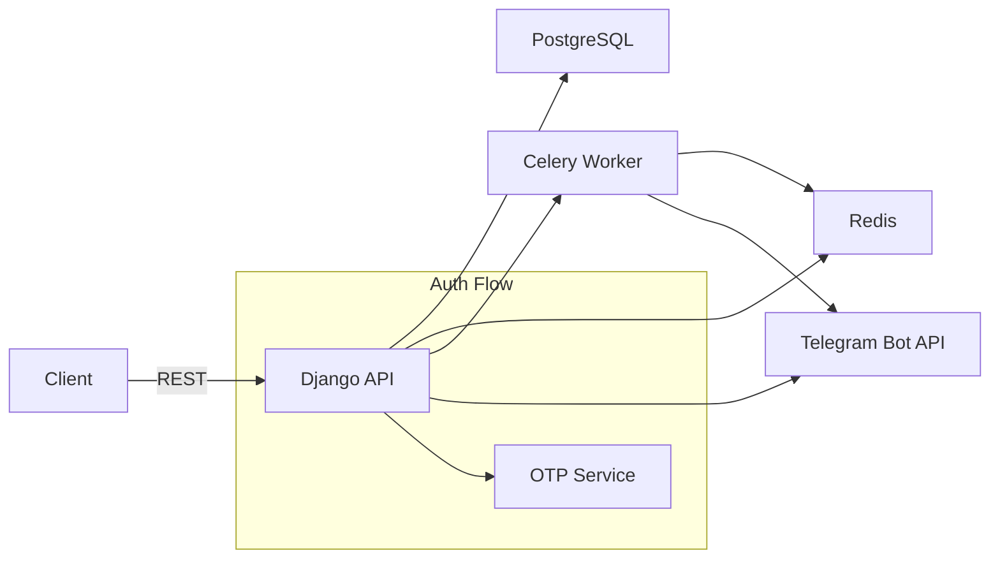

# Arxitektura Umumiy Ko'rinish

Mendeleyev backend — ko'p filialli (multi-branch) ta'lim boshqaruv platformasi uchun xizmat qiluvchi REST API. Asosiy tamoyillar:

- Monolith Django + DRF ichida qatlamli modular tuzilma (`apps/`, `auth/`, `bot/`).
- RBAC: Filialga bog'langan rollar (`UserBranch.role`).
- Auth: Telefon raqami → bir martalik OTP tasdiq → parol o'rnatish → branch-scoped JWT.
- Asinxron ishlar: Celery + Redis (OTP jo'natish, Telegram alertlar).
- Monitoring & Observability: structured loglar, Telegram error alert (prod), rotating log fayllar.
- Idempotent & stateful auth flows: har bir stepda `state` qaytarish (NOT_VERIFIED, NEEDS_PASSWORD, READY, MULTI_BRANCH, NO_BRANCH).

## High-Level Diagram

## Komponentlar
- Django Core (`core/`): sozlamalar, URL marshrut, WSGI/ASGI entrypoints.
- Auth App (`auth/users`, `auth/profiles`): Custom user modeli, branch membership, auth end-pointlar.
- Branch App (`apps/branch`): Filial modeli (status, type, slug) va status transitionlar. (Hozircha oddiy CRUD + membership).
- Common App (`apps/common`): OTP servis, logging handlers, middlewares, Celery tasks.
- Bot App (`apps/botapp` + `bot/`): Aiogram v3 webhook integratsiyasi.

## Hayotiy Sikl
1. Admin foydalanuvchini yaratadi (telefon + optional ism). `phone_verified=False`, parol yo'q (unusable).
2. Foydalanuvchi telefonini tekshiradi (`phone/check`) → `NOT_VERIFIED`.
3. OTP olish (`phone/verification/request`) → kodni tasdiqlash → `NEEDS_PASSWORD`.
4. Parol o'rnatish → `READY`.
5. Login → bitta filial bo'lsa avtomatik scope, ko'p bo'lsa `MULTI_BRANCH` va ro'yxat.
6. JWT access token claim: `br`, `br_role` (oddiy user) yoki global (admin).
7. Refresh token scope tekshiradi: filial active + membership mavjud.
8. Branch switch endpoint yangi scoped access/refresh beradi.

## Nega Branch-Scoped JWT?
- Frontend UI sessioni konkret filial kontekstida ishlaydi (jadval, darslar, hisobotlar).
- Ruxsatni har requestda tekshirish soddalashadi (header emas, token claim).
- Multi-branch foydalanuvchi tokenlarni almashtirishi mumkin (`branch/switch`).

## DRF & Schema
- drf-spectacular → `/api/schema/` JSON, `/api/docs/` Swagger, `/api/redoc/` Redoc.
- Har bir view `extend_schema` bilan minimal annotatsiya.

## Celery Integratsiyasi
- Broker + result backend: Redis.
- Tasks: `send_sms_otp_task`, `send_telegram_otp_task`, `send_unknown_phone_attempt_task`, error alert handler.
- Eager mode (`CELERY_TASK_ALWAYS_EAGER=true`) test va devda tezkor ishlash.

## Logging
- Format: `LOG_FORMAT=json|text` env orqali.
- Handlers: console, rotating file (app, requests, celery), Telegram (ERROR only, prod).
- Request logging middleware har bir HTTP requestni yozadi: method, path, status, ms, user_id.

## Xavfsizlik Asoslari
- Custom user (UUID PK) + phone unique.
- OTP attempt limit (Redis TTL + attempts counter).
- Cooldown (spamdan himoya).
- Token refreshda membership + branch status re-validate.
- Secret key va boshqa envlar `.env` orqali.

## Shkalalanish
- Monolith → horizontal scale (Django + gunicorn) + separate Celery workerlar.
- Redis → OTP + Celery; Postgres → transactional data.
- Nginx → reverse proxy + static/media.

## Key Future Enhancements
- Audit log (login, branch switch, password change, IP/UA).
- Rate limiting (DRF throttling) login va OTP endpointlarda.
- Permission layer kengaytirish (modelga qarab fine-grained qoidalar).

---
Keyingi: [Xizmatlar tafsilotlari](./services.md)