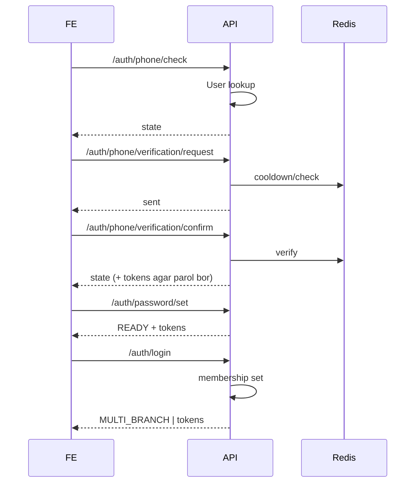

# Xizmatlar va Komponentlar Tafsilotlari

Quyida har bir ichki komponentning roli, asosiy interfeyslari va muhim bog'liqliklari beriladi.

## Django Layer
- `core/settings.py`: konfiguratsiya (DB, Redis, Celery, JWT, Logging, OTP parametrlar).
- `core/urls.py`: umumiy URL marshrutlari (auth, profile, bot webhook, docs).
- Middleware: `apps.common.middlewares.request_logging.RequestLoggingMiddleware` — request konteksti logga.

## Auth (`auth/users`)
- Models:
  - `User`: UUID PK, `phone_number`, `phone_verified`, `auth_state` (computed property), M2M -> Branch through `UserBranch`.
  - `UserBranch`: user-branch membership + role (`BranchRole`).
- Views (asosiy): `PhoneCheckView`, `PhoneVerificationRequestView`, `PhoneVerificationConfirmView`, `PasswordSetView`, `LoginView`, `RefreshTokenView`, `SwitchBranchView`, `MyBranchesView`.
- Serializers: Har view uchun validation (e.g. `LoginSerializer` branch_id optional, `PhoneVerificationConfirmSerializer`).
- Permissions: `HasBranchRole` token claim `br` ga qarab rolni tekshiradi.

## Branch (`apps/branch`)
- Model: `Branch` (name, slug, status, type). Statuslar: `pending`, `active`, `inactive`, `archived`.
- Manager & QuerySet: filtr helperlar (`status_active`, `schools()`).
- Foydalanish: Login vaqtida `active` bo'lmagan filiallarga scope berilmaydi; refresh paytida ham tekshiruv.

## Common (`apps/common`)
- OTP service: `OTPService` (Redis/in-memory fallback). Methods: `request_code(phone, purpose)`, `verify_code(phone, code, purpose)`.
- Redis keys namespacing: prefix + purpose (`verify`, `reset`, `register`, `generic`).
- Tasks:
  - `send_sms_otp_task`: hozircha mock/log (SMS provider integratsiyasi bo'sh joyi).
  - `send_telegram_otp_task`: dev/prod adminlarga OTP kodini test maqsadida yuborishi mumkin.
  - `send_unknown_phone_attempt_task`: notanish telefon login/phone check harakati haqida adminlarga xabar.
- Logging handlers: `TelegramAdminHandler`, `ProductionErrorFilter`.

## Bot (`apps/botapp` + `bot/`)
- Entry view: `apps/botapp.views.telegram_webhook` — aiogram Dispatcherga update uzatadi.
- Dispatcher: `bot/dispatcher.py` — routerlarni yig'adi.
- Handlers: `bot/handlers/...` — modul bo'lib ajratilgan (users, admins, errors, etc.).
- Webhook management commands: `setwebhook`, `deletewebhook`, `webhookinfo`.

## Celery Integration
- Worker jarayoni OTP va Telegram tasksni bajaradi.
- Eager test rejimi: `CELERY_TASK_ALWAYS_EAGER=True`.
- Task time limitlar: hard (10m) / soft (5m).

## JWT & Token Claims
- Access token claims (oddiy user): `br`, `br_role`.
- Refresh token ham shu claimlarni tashiydi; refresh paytida branch/membership re-validatsiya.
- Superuser/staff: global token (claimsiz) yoki ixtiyoriy branch scope (`branch_id` bilan login).

## Request Lifecycle (Auth Specific)

## Error Handling Strategy
- Har bir xatolik JSON: `{ "detail": "..." }`.
- OTP cooldown: 429 (Too Many Requests).
- Invalid credentials: 400.
- Branch/membership yo'q bo'lsa login: 200 + `state` (soft-fail UX). Token refreshda esa 401.

## Extensibility Nuqtalari
- SMS provider: `send_sms_otp_task` ichida real integratsiya qo'shish mumkin.
- Role kengaytirish: `BranchRole` ga yangi `CHOICES` qo'shish.
- Advanced permission: custom DRF permission klasslarini token claim + DB qatlam bilan boyitish.

---
Keyingi: [Ma'lumotlar modeli (ER)](./data-model.md)